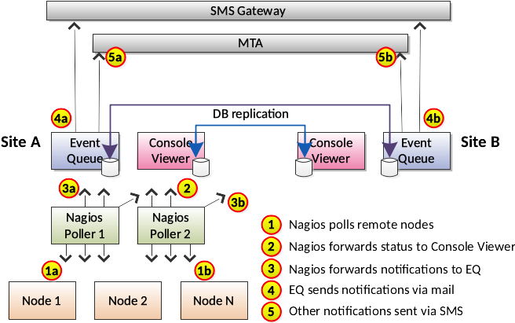
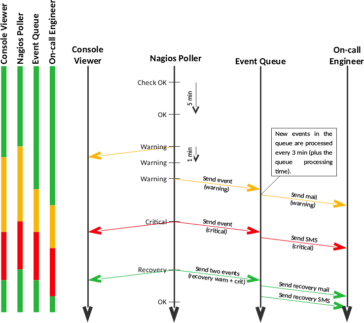

# Event Queue

Event Queue (EQ) is an application designed to collect events from different sources and process them in sequence. Think of it as a First-In-First-Out (FIFO) queue - older events will be processed first.

In addition, when processing events, the EQ also offers a mechanism to handle the events in different ways. This is archived using the ```q``` (pseudo) scripting language (more details below).

It was mostly designed for Nagios (and clones) but can also be used to feed events from other systems.

There are two different applications:

* ```eq``` - the event queue itself, with ```q``` interpreter.
* ```eqweb``` - a web interface to search the event queue

## Fundamental Design Premises

* The EQ must not lose events. Everything that happens should hit the queue in the same order as it happened. New events are marked as 'unhandled'. When processing 'unhandled' events, you must decide if and how such events should be handled.
* The EQ is "event agnostic". Currently the EQ is mostly used for Nagios events, but it should support other sources.
* Processing the EQ must be idempotent. 'Unhandled' events should be processed **once** and **only once**. Once processed, such events will be marked 'handled' (in some way defined by you) and must **not** be processed again.

## eq

Configure your Nagios to handle host notifications as follows:

```bash
/usr/local/sbin/host-notify-by-eq.sh "$NOTIFICATIONTYPE$" "$HOSTSTATE$" "$HOSTSTATETYPE$" "$LASTHOSTSTATE$" "$HOSTADDRESS$" "$HOSTALIAS$" "$DATE$" "$TIME$" "$HOSTOUTPUT$" "$HOSTEVENTID$" "$LASTHOSTEVENTID$"
```

Please note that not all Nagios host events are used by the Event Queue:

```$HOSTEVENTID$``` - A globally unique number associated with the host's current state. Every time a host (or service) experiences a state change,
a global event ID number is incremented by one (1). If a host has experienced no state changes, this macro will be set to zero (0).

```$LASTHOSTEVENTID$``` - The previous (globally unique) event number that was given to the host.

---
And service notifications using:

```bash
/usr/local/sbin/service-notify-by-eq.sh "$NOTIFICATIONTYPE$" "$SERVICESTATE$" "$SERVICESTATETYPE$" "$LASTSERVICESTATE$" "$HOSTALIAS$" "$SERVICEDESC$" "$DATE$" "$TIME$" "$SERVICEOUTPUT$" "$SERVICEEVENTID$" "$LASTSERVICEEVENTID$"
```

Again, please note that not all Nagios service events are used by the Event Queue:

```$SERVICEEVENTID$``` - A globally unique number associated with the service's current state. Every time a a service (or host) experiences a state change,
a global event ID number is incremented by one (1). If a service has experienced no state changes, this macro will be set to zero (0).

```$LASTSERVICEEVENTID$``` - The previous (globally unique) event number that given to the service.

---
Events are processed in order (FIFO) by ```q``` - a very simple, Python like, "Event Queue" processing language (see below).

```console
         .------ SMSSENT
        /  .---- MAILSENT
       /  /  .-- IGNORED
      /  /  /
2^ (  2  1  0  )
      4  2  1
------------------------------------------------------------------------
  0   0  0  0   event is unhandled
  1   0  0  1   event is ignored
  2   0  1  0   event was sent via email
      0  1  1   invalid state (can't be ignored and mailsent)
  4   1  0  0   event was sent via SMS
      1  0  1   invalid state (can't be ignored and smssent)
  6   1  1  0   event was sent via email and SMS
      1  1  1   invalid state (can't be ignored and another non-ignored)

Handled states:
 UNHANDLED = 0
 IGNORED   = 1
 MAILSENT  = 2
 SMSSENT   = 3
```

### eq heartbeat

On your pollers, setup an Event Queue HEARTBEAT event, for example, from a cronjob:

```bash
$ cat /etc/cron.d/eq-heartbeat

SHELL=/bin/sh
PATH=/usr/local/sbin:/usr/local/bin:/sbin:/bin:/usr/sbin:/usr/bin

*/5 * * * * root /usr/bin/curl -i --noproxy eqhost -H "Content-Type: application/json" -X PUT -d '{"source":"'`hostname`'", "type":"HEARTBEAT", "state":"ACTIVE", "date":"'`date +\%Y-\%m-\%d`'", "time":"'`date +\%H:\%M:\%S`'"}' http://eqhost:5555/eq/new-heartbeat-event >/dev/null 2>&1
```

---
Create a check command to check the heartbeat:

```bash
$ cat /etc/nagios/nrpe.d/check_eq_heartbeat.cfg

command[check_eq_heartbeat]=/usr/local/lib/nagios/plugins/check_eq_heartbeat
```

And finally deploy the ```check_eq_heartbeat``` on the ```eqhost``` server.

## eqweb

This is a simple Event Queue web interface (see the [README](eqweb/README.md) file).

## Event Flow

The following picture describes the event flow:



---
A time flow diagram would look like this:



## q Scripting Language

```q``` is a very simple (pseudo) scripting language designed to run over the Event Queue. The following methods are available to be used in ```q``` (the rest is just normal Python code):

* ```q.age()``` - Return the age of the current event (in seconds).
* ```q.sleep(secs)``` - Sleep for ```secs``` amount of seconds.
* ```q.whoisoncall()``` - Return the phone number of the current on-call engineer or ```None``` if not found.
* ```q.sendsms(number, proto=SMPP)``` and ```q.sendsms(number, proto=SMTP)``` - Send the current event to SMS via the specified protocol.
* ```q.sendmail(email)``` - Send the current event to email.
* ```q.ignore()``` - Mark the current event as 'to be ignored'.
* ```q.first()``` - Set the cursor to the first event in the queue.
* ```q.first_heartbeat()``` - Set the cursor to the first heartbeat events.
* ```q.first_unhandled()``` - Set the cursor to the first unhandled event in the queue.
* ```q.next()``` - Set the cursor to the next event or None if no more events exits.

---
q event methods:

* ```q.event``` - Return the current event (None if not set) in a pretty-printing format.
* ```q.event.is_handled()``` - Return ```True``` if at least one bit is set (the event is handled).
* ```q.event.is_ignored()``` - Return ```True``` if the ```IGNORED``` bit is set. Otherwise, return ```False```.
* ```q.event.is_mailsent()``` - Return if the ```MAILSENT``` bit is set. Otherwise, return ```False```.
* ```q.event.is_smssent()``` - Return if the ```SMSSENT``` bit is set. Otherwise, return ```False```.
* ```q.event.set_ignored()``` - Mark the event as ```IGNORED```.
* ```q.event.set_mailsent()``` - Mark the event as ```MAILSENT```.
* ```q.event.set_smssent()``` - Mark the event as ```SMSSENT```.
* ```q.event.time_is_between(hr1, min1, hr2, min2)``` - Return ```True``` if event time happened between ```hr1:min1``` and ```hr2:min2```.
* ```q.event.weekday()``` - Return the weekday of the event (e.g., Monday, Tuesday, ... Sunday).
* ```q.event.time_is_between(hr1, min1, hr2, min2)``` - Return ```True``` if event's time is between ```hr1:min1``` and ```hr2:min2```.
* ```q.event.weekday_is_equal(weekday)``` - Return ```True``` if event's week day is weekday.
* ```q.event.id()``` - Return the event's ID.
* ```q.event.ts()``` - Return the event's timestamp (when it actually arrived at the event queue). Format is: ```%Y-%m-%d %H:%M:%S```.
* ```q.event.source()``` - Return the event's source.
* ```q.event.eventid()``` - Return the event's ID (provided by Nagios or another similar source).
* ```q.event.lasteventid()``` - Return the last event's ID (provided by Nagios or another similar source).
* ```q.event.type()``` - Return the event's type (e.g., PROBLEM, RECOVERY).
* ```q.event.state()``` - Return the event's state (e.g., CRITICAL, WARNING, OK, UNKNOWN).
* ```q.event.statetype()``` - Return the event's (e.g., SOFT, HARD).
* ```q.event.count()``` - Return the event's count (how many times did it happen so far).
* ```q.event.handled()``` - Return the 1 if event has been handled; otherwise return 0.
* ```q.event.ipv4()``` - Return the event's IPv4 address (if applicable).
* ```q.event.hostname()``` - Return the event's hostname.
* ```q.event.servicename()``` - Return the event's service name.
* ```q.event.date()``` - Return the event's date (when it actually happened). Format is: ```%d-%m-%Y```.
* ```q.event.time()``` - Return the event's time (when it actually happened). Format is: ```%H:%M:%S```.
* ```q.event.weekday()``` - Return the event's weekday (e.g., 'Monday', 'Tuesday', 'Wednesday', etc.)
* ```q.event.message()``` - Return the event's description.

## Future Work

* There are many TODOs in the code.
* Redundant queue.
* Redundant event dispatching.

## Contributors

* [Jorge Morgado](https://github.com/jorgemorgado) (Author)

## License

Released under the [MIT License](http://www.opensource.org/licenses/MIT).
